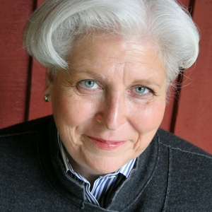
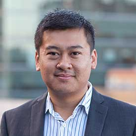

Startup Sonoma County provides a modern, fully-operational environment for
local entrepreneurs to work together, incubate, and accelerate their
businesses. Our state-of-the-art office space offers a low-investment
opportunity for outstanding Sonoma County professionals to network,
collaborate, and evolve their business ideas. Our wide-reaching advisory
network facilitates and fosters rapid development through mentorship,
thought-leadership, and strategic socialization. In turn, our community-wide
partnerships serve local business and retain top-talent in Sonoma county by
resourcing and advocating for the local business community.

<!-- Begin MailChimp Signup Form -->

    <form action="https://startupsonoma.us18.list-manage.com/subscribe/post?u=6ad0494041b32796f046a3e6e&amp;id=562eb39731" method="post" id="mc-embedded-subscribe-form" name="mc-embedded-subscribe-form" class="validate" target="_blank" novalidate>
        

            <h2>Get the latest news and updates</h2>
            
                <input placeholder="Email address (required)" type="email" value="" name="EMAIL" class="required email" id="mce-EMAIL">
            
            
                <input placeholder="Your name" type="text" value="" name="FULL_NAME" class="" id="mce-FULL_NAME">
            
            
                <input type="submit" value="Subscribe" name="subscribe" id="mc-embedded-subscribe" class="button">
            
            <input type="hidden" value="homepage" name="MMERGE7" class="" id="mce-MMERGE7">
            

                

                

            

            <!-- real people should not fill this in and expect good things - do not remove this or risk form bot signups-->
            

                <input type="text" name="b_6ad0494041b32796f046a3e6e_562eb39731" tabindex="-1" value="">
            

        

    </form>

<!--End mc_embed_signup-->

## Upcoming Events

* **Cowork and Coffee**: wednesdays from 1-3pm at Acre Coffee at 621 4th St, Santa Rosa
  * Current and future members of Startup Sonoma County are invited to "Cowork and Coffee"
* **Monthly Meetup**
  * Scheduled on [our Meetup group](https://www.meetup.com/Startup-Sonoma/),
    meet other entrepreneurs to get feedback, share challenges, find solutions.

Additional events can be found as they're scheuled on **[our Meetup group](https://www.meetup.com/Startup-Sonoma/)**.

## The Space

Sonoma county is littered with fragmented pockets of innovation, garage
hackers, telecommuters, and hidden-away new businesses. Startup Sonoma County
aims to rally those talented entrepreneurs into a more cohesive virtual and
physical community. By providing a shared **physical incubation space** in
[Santa Rosa](https://en.wikipedia.org/wiki/Santa_Rosa,_Ca),
the largest city north of San Francisco, new startups will benefit from direct
discussions and frequent collaboration with their fellow North Bay
entrepreneurs.

Unlike a coworking space, Startup Sonoma County is not a public
bill-by-hour-space, but rather a location where new startups are incubated,
ideas are shared, and mutual support is the norm. New members are expected to
“give before they get” and must help the entire community grow and thrive.

  
 powered by <a href="https://admin.typeform.com/signup?utm_campaign=RDjEDM&utm_source=typeform.com-9917016-Pro&utm_medium=typeform&utm_content=typeform-embedded-poweredbytypeform&utm_term=EN" style="color: #999" target="_blank">Typeform</a> 

## The Team

Startup Sonoma County is focused on fostering innovation in the
North Bay through collaboration and events. Our efforts are spear-headed by the [founding
team](#founders) and our talented [board of advisors](#board-advisors).

### Board of Advisors

[Sherry Huss](https://twitter.com/SherryHuss), co-creator of Maker Faire and
Vice President of Maker Media, helping to create the Maker Movement, a
tech-focused community of do-it-yourselfers ahd events.  Sherry oversees
community, partnerships, and events. She is focused on growing the MAKE brand
throughout the Maker ecosystem which includes 221 Maker Faires around the world
and 1.75M people attending an event in their community.

 

[Erin Rose Opperman](http://erinrosecreative.com/), a Sonoma county based visual designer and creative strategist. Previously, Erin was the Art Director for Sonoma
county's award-winning agency "[The Engine is
Red](http://theengineisred.com/)", where she created brand strategies,
marketing concepts, and more.

 

### Founders

[R Tyler Croy](https://twitter.com/agentdero),
located in Santa Rosa led product and engineering groups at Slide. Apture.
(both acquired by Google), and Lookout. He has consistently built product
engineering teams to deliver successful new products which reach tens of
millions monthly active users. Tyler is also on the board for the
[Jenkins](https://jenkins.io) project and [Software in the Public
Interest](https://spi-inc.org).

[Dana Woodman](https://twitter.com/danawoodman),
located in Sebastopol, founded the first-of-its-kind [Chimera Arts and
Makerspace](http://www.chimeraarts.org/) over six years ago in Sebastopol. In
addition to cultivating and growing the “maker” community in Sonoma county,
Dana also founded [BIG](http://builtbybig.com/), a technology and design studio
which builds software products and services for companies large and small.

[Abhi Yerra](https://twitter.com/abhiyerra),
 located in Santa Rosa, Abhi founded [opsZero](https://www.opszero.com/) in
Sonoma County, a steadily growing company which provides operations and
technology infrastructure (“DevOps as a Service”) to many Y Combinator-backed
technology startups throughout the Bay Area.

 

### Advisors

[Thomson Nguyen](https://twitter.com/itsthomson), an Entrepreneur in Residence
at Kleiner Perkins Caufield & Byers. He was recently the Head of Data Science
at Square Capital, the small-business lending arm for Square. Before that, he
was co-founder and CEO of Framed Data, which was acquired by Square in 2016.

 
