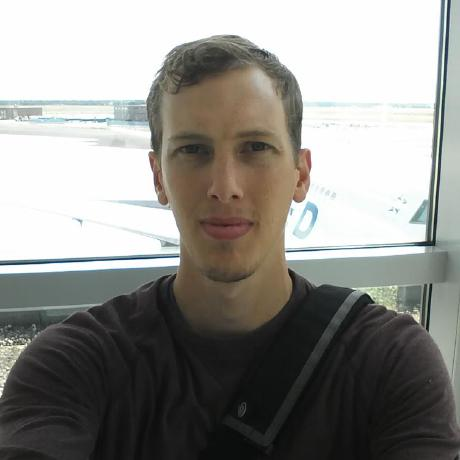
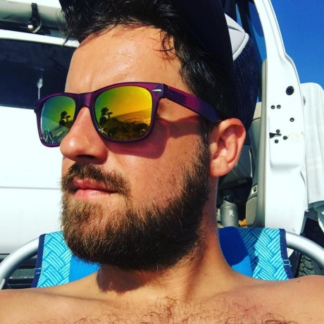
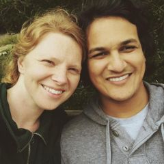

Startup Sonoma County provides a productive and dynamic environment to help
Sonoma county technology startups and entrepreneurs achieve success faster, and
more consistently, than they may otherwise accomplish alone.  With a physical
space and a  culture of sharing knowledge, skills, and resources, North Bay
entrepreneurs will find it easier to innovate and invest in the success of
Sonoma county.

## Upcoming Events

* **Cowork and Coffee**: wednesdays from 1-3pm at Acre Coffee at 621 4th St, Santa Rosa
  * Current and future members of Startup Sonoma County are invited to "Cowork and Coffee"
* **Monthly Meetup**
  * Scheduled on [our Meetup group](https://www.meetup.com/Startup-Sonoma/),
    meet other entrepreneurs to get feedback, share challenges, find solutions.

Additional events can be found as they're scheuled on **[our Meetup group](https://www.meetup.com/Startup-Sonoma/)**.

## The Space

Sonoma county is littered with fragmented pockets of innovation, garage
hackers, telecommuters, and hidden-away new businesses. Startup Sonoma County
aims to rally those talented entrepreneurs into a more cohesive virtual and
physical community. By providing a shared **physical incubation space** in
[Santa Rosa](https://en.wikipedia.org/wiki/Santa_Rosa,_Ca),
the largest city north of San Francisco, new startups will benefit from direct
discussions and frequent collaboration with their fellow North Bay
entrepreneurs.

Unlike a coworking space, Startup Sonoma County is not a public
bill-by-hour-space, but rather a location where new startups are incubated,
ideas are shared, and mutual support is the norm. New members are expected to
“give before they get” and must help the entire community grow and thrive.

  
 powered by <a href="https://admin.typeform.com/signup?utm_campaign=RDjEDM&utm_source=typeform.com-9917016-Pro&utm_medium=typeform&utm_content=typeform-embedded-poweredbytypeform&utm_term=EN" style="color: #999" target="_blank">Typeform</a> 

## The Team

Startup Sonoma County is a community organization fostered by the following core team and a incredibly helpful group of advisors.

### Core

[R Tyler Croy](https://twitter.com/agentdero),
located in Santa Rosa led product and engineering groups at Slide. Apture.
(both acquired by Google), and Lookout. He has consistently built product
engineering teams to deliver successful new products which reach tens of
millions monthly active users. Tyler is also on the board for the
[Jenkins](https://jenkins.io) project and [Software in the Public
Interest](https://spi-inc.org).

[Dana Woodman](https://twitter.com/danawoodman),
located in Sebastopol, founded the first-of-its-kind [Chimera Arts and
Makerspace](http://www.chimeraarts.org/) over six years ago in Sebastopol. In
addition to cultivating and growing the “maker” community in Sonoma county,
Dana also founded [BIG](http://builtbybig.com/), a technology and design studio
which builds software products and services for companies large and small.

[Abhi Yerra](https://twitter.com/abhiyerra),
 located in Santa Rosa, Abhi founded [opsZero](https://www.opszero.com/) in
Sonoma County, a steadily growing company which provides operations and
technology infrastructure (“DevOps as a Service”) to many Y Combinator-backed
technology startups throughout the Bay Area.
